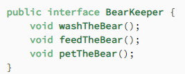
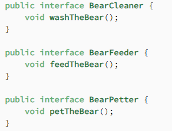

#### 1. S - Single responsibility ####
Class should only have one responsibility - should have only one reason to change.  
(example: Book, BookPrinter)
###### Benefits: ######
1. Testing - fewer test cases
2. Less functionality in a single class will have fewer dependencies.
3. Organization - easier to search thanks to the classes being small.

#### 2. O - Open for Extensions ####
**nie rozumiem czemu mialoby nie byc kiedykolwiek**  
Classes should be open for extension but closed for modification. (don't change code in the class, extend it to another)

#### 3. L - Liskov Substitution _(most complex)_ ####
If class A is a subtype of class B, we should be able to replace B with A without disrupting the behavior of our program.

#### 4. I - Interface segregation ####
Larger interfaces should be split into smaller ones. By doing so we can ensure that implementing classes only need
to be concerned about the method that are of interest to them.  
Exeample: interface contains area and value methods, but circle or rectangle can't have value.
#  --------------> 

#### 5. D - Dependency inversion ####
The principle of dependency inversion refers to the decoupling of software modules. This way, instead of high-level modules depending on low-level modules, both will depend on abstractions.

### Custom list ###
1. Single responsibility - Klasa wykonuje wiele czynności, dodaje, filtruje, usuwa i wyczytuje na różne sposoby.
2. Open for extensions - Wypadałoby podzielić za pomocą innych klas na queue, dequeue.
3. Liskov substitution - zalezy od zaimplementowania czwartego punktu
4. Interface Segregation - Dodanie interfejsów na metody remove, getAllInOrder - mogą znajdować się w jednym
   interfejsie (chyba)
5. Dependency inversion - ??

### WowCharacter ###
1. Single responsibility - oddzielenie durationTime od WowCharacter, poza tym wyglada ok
2. Open for Extensions - wyglada ok
3. Liskov Substitution - zamiana obiektu frost na WowCharacter uniemozliwia uzycie metody frostRotationSummary -
   przeniesienie do interfejsu
4. Interface segregation - przeniesienie metody abstrakcyjnej .rotation() do interfejsu
5. Dependency inversion - ??

### TicTacToe ###
1. Single responsibility - skan indeksu do oddzielnej klasy??
2. Open for Extensions - no chyba tak
3. Liskov Substitution - --
4. Interface segregation - --
5. Dependency inversion  -

### BinaryTree ###
1. Single responsibility - ta sama klasa czyta i dodaje - dodanie klasy TreeReader
2. Open for Extensions - no chyba tak
3. Liskov Substitution - --
4. Interface segregation - --
5. Dependency inversion - --